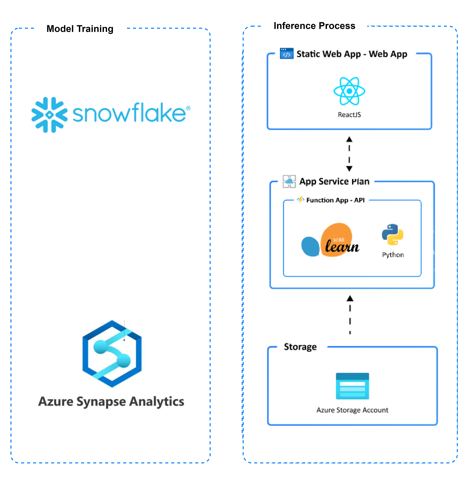

  
  
  
  

# Psychology Insights Frontend

### Application Architecture

This application utilizes the following Azure resources:

- [Azure Function](https://docs.microsoft.com/azure/azure-functions/): Serverless compute service for executing functions
- [Azure Static Web App](https://docs.microsoft.com/azure/static-web-apps/): Hosting service for static web applications
- [Azure Storage Blob](https://docs.microsoft.com/azure/storage/blobs/): Storage service for storing files and data
- [React](https://reactjs.org/): JavaScript library for building user interfaces
- [Python](https://www.python.org/): Programming language used for backend development
- [scikit-learn (sklearn)](https://scikit-learn.org/): Python library for machine learning
- [Snowflake](https://www.snowflake.com/): Cloud data platform for data warehousing and analytics
- [Azure Synapse](https://azure.microsoft.com/services/synapse-analytics/): Fully managed analytics service for big data and data integration

Here's a high-level architecture diagram that illustrates the components and their interactions:

This repository contains the frontend code and backend code for the Psychology Insights project. It includes the Azure Function and Azure Static Web App components for the web application. The code for training the model can be found in separate repositories, namely [psychology-insights-snowflake-training](https://github.com/fuguixing/psychology-insights-snowflake-training) and [psychology-insights-synapse-training](https://github.com/fuguixing/psychology-insights-synapse-training).

## Contributing

We welcome contributions to enhance the functionality and user experience of the Psychology Insights frontend. If you'd like to contribute, please follow these guidelines:

- Fork the repository and create a new branch for your feature or bug fix.
- Commit your changes and push your branch to your forked repository.
- Submit a pull request, describing your changes in detail.

## License

This project is licensed under the [MIT License](LICENSE).
